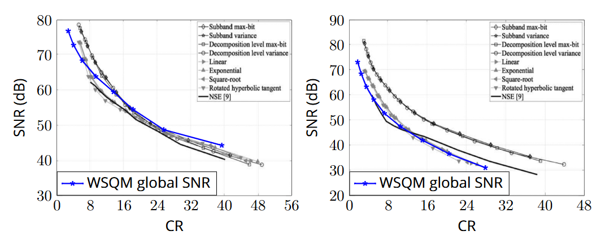

# Wavelet Spectral Quantization Models

This repository provides a Python-based implementation of the method described in the article:  

---

**Francisco A. de O. Nascimento, Raimundo G. Saraiva, Jr. and Jorge Corman.**  
*"Improved Transient Data Compression Algorithm Based on Wavelet Spectral Quantization Models."*  
**IEEE Transactions on POWER DELIVERY VOL. 35, NO. 5, OCTOBER 2020.**  
[[https://ietresearch.onlinelibrary.wiley.com/doi/full/10.1049/iet-gtd.2014.0806](https://ieeexplore.ieee.org/abstract/document/7336565)](https://ieeexplore.ieee.org/abstract/document/8950328)

The code is provided as an open-source implementation since the original article did not include one. This repository can serve as a starting point for researchers and engineers interested in experimenting with or extending the method’s capabilities.

---

## Main Scripts

This repository includes two main scripts:  
- **WSQM_Rate_Constraint:** Implements the method with a fixed bit rate constraint.  
- **WSQM_Quality_Constraint:** Implements the method with a fixed quality constraint.  

Either script can be run directly after downloading the full OHD code.

---

## Key Parameters

### Data Source and Parameters 
By default, the code uses 12 three-phase voltage signals from the [Data_S](https://github.com/rte-france/digital-fault-recording-database) dataset. These signals are selected because they correspond to known faults. Each signal is one second long and sampled at 6400 Hz, resulting in 100 non-overlapping 20 ms windows per signal.

- **Number of signals:** The number of signals to encode is controlled by `nb_signal`.  
- **Number of phases:** Specified by `nb_phase`:  
  - `nb_phase=3` processes only the three voltage phases.  
  - `nb_phase=6` includes both the three voltage phases and three current phases for all 12 signals.  
- **Number of windows (`nb_w`):** By default, the first 50 windows of each signal are encoded. This can be adjusted to process more or fewer windows per signal.
- **Window Size (`N`):** Each window is set to 128 samples by default. This can be adjusted by modifying `N` in the script.  

### Key Parameter for Rate Constraint

- **Maximum Bit Rate (`n_tot`):** The total bit rate allocated for encoding each window is 128 bits (equivalent to 1 bit per sample) by default. You can modify `n_tot` to explore different encoding rates.

### Key Parameters for Quality Constraint

- **Quality Constraint (`quality`):** The default quality threshold is an RMSE of 200 V. Adjusting `quality` allows you to experiment with different levels of reconstruction accuracy and compression performance.  
- **Available Metrics:** The code supports three quality metrics derived from the L2 norm: RMSE, MSE, and -SNR.

---

## **Overview**  
WSQM (Wavelet-Based Scalable Quantization Method) is a quantization and encoding technique designed for wavelet-transformed signals. The method applies different quantization models to efficiently allocate bits while minimizing distortion under a given bitrate constraint. This repository provides an implementation of WSQM, including wavelet decomposition, quantization, binarization, and entropy coding.  

## **Methodology**  

### **1. Wavelet Transform**  
- The Discrete Wavelet Transform (DWT) is applied to an input signal **x** of **N** samples using the **Coifman 5** wavelet.  
- This decomposition results in **log₂(N)** sub-bands and one approximation coefficient.  

### **2. Quantization**  
- The wavelet coefficients in each sub-band are quantized using a **midrise quantizer**.  
- The quantization step size for each band **k** is determined as:  
```math
  \Delta_k = \frac{2}{2^{n_k}}
```
  where **nₖ** is a natural number, and **k = 1, …, log2(N)+1** represents the band index.  

### **3. Quantization Models**  
To determine the values of **nₖ**, different quantization two decay models are tested in this version 
- **Linear Decay Model:**  
```math
  B_m = (Q_{\text{max}} - Q_{\text{min}})(-2^{m-M} + 1) + Q_{\text{min}}
```
  where **c₁ = Qmax - Qmin** and **c₂ = Qmin**.  

- **Exponential Decay Model:**  
```math
  B_m = Q_{\text{min}} \left(\frac{Q_{\text{max}}}{Q_{\text{min}}}\right)^{-2^{m-M}+1}
```
  where **c₁ = Qmin** and **c₂ = (Qmax / Qmin)**.  

### **4. Binarization and Entropy Coding**  
After quantization, the coefficients are binarized using:  
1. **Exponential-Golomb Coding** to represent quantized coefficients efficiently.  
2. **CABAC (Context-Based Adaptive Binary Arithmetic Coding)**, which encodes each bit with a distinct context for different binary weights.  

### **5. Rate - Quality Optimization**  
- The reconstructed signal is evaluated based on **bitrate** and **distortion**.  
- An iterative process adjusts **Qmin** and **Qmax** to minimize distortion while satisfying the bitrate or quality constraint.  
- Part of the bit budget is reserved for encoding **Qmin**, **Qmax**, and the chosen quantization model.  

---

## Evaluation of Reimplemented WSQM Method vs. Original Method



*Figure: Global SNR (dB) (4) as a function of Compression Ratio (CR) for the EPRI database, focusing on voltage phase A (right) and current phase A (left), with an initial rate of 16 bits per sample. Black: image extracted from [Nascimento et al., 2020](https://ieeexplore.ieee.org/abstract/document/8950328); Blue: results obtained using our partial implementation of WSQM. Refer to [Nascimento et al., 2020](https://ieeexplore.ieee.org/abstract/document/8950328) for experimental details on how these results were obtained.*

---

# Prerequisites

- numpy


- matplotlib.pyplot
